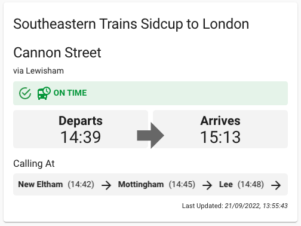
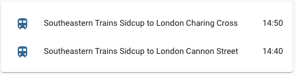

# National Rail Departure Times Integration Component by [@crismc](https://github.com/crismc). 
## Updated by [@miawgogo](https://github.com/miawgogo) for new Darwin JSON API. 
### API and Card Updates by [@alexratman](https://github.com/alexratman)
- Enhanced sensor logic to handle updated Darwin JSON API structure.
- Aligned `st` and `et` in calling points for improved compatibility with the new Lovelace card.
- Fixed issues with edge-case scenarios (e.g., delayed services, arrival/departure times).

[![hacs][hacs-badge]][hacs-url]
[![release][release-badge]][release-url]
![downloads][downloads-badge]

A custom Home Assistant component to show next available trains to specific stops through the National Rail Darwin JSON API, this was mainly done as the RDG(Rail Delivery Group) replaced the old national rail enquiries api signup with a new "marketplace" and replaced the old SOAP api with a new JSON api(that is poorly documented).
For better visuals, to be used with the Home Assistant custom card homeassistant_nationalrailtimes_lovelace (https://github.com/crismc/homeassistant_nationalrailtimes_lovelace)

Creates a sensor for each station/destination, reporting arrival/destination times, and relevant calling stops along the way coupled with any station messages such as delayed or cancelled services.

Based on the HA-LondonTfl component by [@morosanmihail] (https://github.com/morosanmihail/HA-LondonTfL), and crismc's Darwin SOAP API intergration.

This can be used for any/all stations associated to the National Rail service, and returns service information associated to the GetNextDeparturesWithDetailsRequest.
For information on the SOAP API, visit [Live Departure Boards Web Service (LDBWS / OpenLDBWS)](https://lite.realtime.nationalrail.co.uk/openldbws/)

## Options

| Name                 | Type    | Requirement  | Description                                                                                       | Default |
| ---------------------| ------- | ------------ | --------------------------------------------------------------------------------------------------|---------|
| api_key              | string  | **Required** | Raildata.org.uk api key for "Live Departures Board With Detai"                                    | `none`  |
| arrival              | string  | **Required** | 3 Letter CRX station code of your local station                                                   | `none`  |
| destination          | string  | **Required** | 3 Letter CRX station code of your target destination station                                      | `none`  |
| time_offset          | string  | **Required** | An offset in minutes against the current time to provide the station board for your local station | `none`  |

<!-- Badges -->
[license-shield]: https://img.shields.io/github/license/custom-cards/boilerplate-card.svg?style=for-the-badge
[hacs-badge]: https://img.shields.io/badge/hacs-default-orange.svg?style=flat-square
[release-badge]: https://img.shields.io/github/v/release/crismc/homeassistant_nationalrailtimes_integration?style=flat-square
[downloads-badge]: https://img.shields.io/github/downloads/crismc/homeassistant_nationalrailtimes_integration/total?style=flat-square

<!-- References -->
[hacs-url]: https://github.com/hacs/integration
[hacs]: https://hacs.xyz
[ui-lovelace-minimalist]: https://ui-lovelace-minimalist.github.io/UI/
[release-url]: https://github.com/crismc/homeassistant_nationalrailtimes_integration/releases
